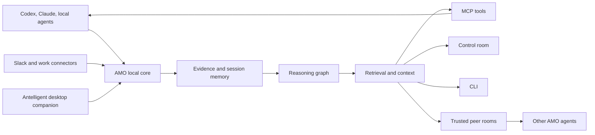

# Agent Memory Orchestrator

<p align="center">
  <strong>Your coding agents should not start from zero every session.</strong><br>
  AMO is a local-first memory, reasoning, and coordination layer for Codex, Claude, Antelligent, Slack, and trusted peer agents.
</p>

<p align="center">
  <a href="./LICENSE"></a>
  
  
  
  
  
</p>

---

## Why AMO Exists

AI coding agents are powerful, but most of their work still disappears at the edge of a session.

A teammate asks why a file changed. A new Codex thread needs the decision that Claude made yesterday. A Slack thread contains the missing context. A peer agent already solved the same problem on another machine. Git can show the diff, but it usually cannot tell the story: what the user wanted, what evidence mattered, what decision was made, what code it touched, and whether that reasoning is still current.

Agent Memory Orchestrator keeps that story local and usable.

AMO captures coding work as evidence, turns closed sessions into reasoning memory, links that memory to commits and code, and exposes it through MCP, CLI, a local control room, Antelligent, connectors, and trusted peer-agent rooms. The result is not a bigger chat log. It is a working memory layer for agents that need continuity.

## What AMO Gives Your Agents

<table>
  <tr>
    <td width="33%"><strong>Local Memory</strong><br>Durable evidence, decisions, code changes, session context, and graph memory stay on the device first.</td>
    <td width="33%"><strong>Reasoning Graph</strong><br>Ask why code changed and get answers grounded in commits, evidence, files, and code support.</td>
    <td width="33%"><strong>Explicit Retrieval</strong><br>Agents retrieve memory only when asked through MCP, CLI, dashboard, or peer-agent flows.</td>
  </tr>
  <tr>
    <td><strong>Antelligent</strong><br>A desktop companion surface that keeps AMO visible and reachable while agents work.</td>
    <td><strong>Peer Agents</strong><br>Trusted agents can exchange policy-gated context over the internet after invite and join.</td>
    <td><strong>Connectors</strong><br>Slack can become evidence and answers today. More work surfaces can plug into the same local memory layer.</td>
  </tr>
  <tr>
    <td><strong>MCP Server</strong><br>Codex, Claude, and local agents can call stable AMO tools instead of scraping files or replaying chat.</td>
    <td><strong>Skill Checkpoints</strong><br>Useful workflows can be marked, extracted, reviewed, and turned into reusable local skills.</td>
    <td><strong>Control Room</strong><br>A local dashboard shows sessions, jobs, retrieval, graph state, and operational health.</td>
  </tr>
</table>

## How It Works



At a high level, AMO runs a Python local runtime with a daemon, MCP server, hooks, local storage, and optional local model providers. It keeps graph truth in Kuzu, ledgers in SQLite, and rebuildable vector search in FAISS when model extras are installed. Those are implementation choices; the product behavior is simpler: agents ask AMO for the memory they need, and AMO returns context with provenance.

## Start In Five Minutes

Install AMO for Codex:

```bash
npx -y agent-memory-orchestrator-cli@latest -- install --target codex --preset cpu-balanced --qwen-model qwen3.5:9b
amo-cli doctor --target codex
amo-daemon
```

Install for both Codex and Claude:

```bash
npx -y agent-memory-orchestrator-cli@latest -- install --target all --preset cpu-balanced --qwen-model qwen3.5:9b
amo-cli doctor --target all
amo-daemon
```

Open the local control room:

```text
http://127.0.0.1:8765
```

Ask AMO directly:

```bash
amo-cli graph-retrieve --query "why did retry logic change?"
```

<details>
<summary>Recommended local model setup</summary>

AMO is local-first. For local Qwen reasoning, install Ollama and pull a Qwen model:

```bash
ollama pull qwen3.5:9b
```

The installer supports smaller local profiles too. Use the model that fits the machine.

</details>

## Use It With Your Agents

AMO is designed to sit beside agents, not replace them.

Through MCP, agents can ask for current context, decision history, work history, raw evidence when explicitly requested, merge status, or peer-agent help. A normal agent flow looks like this:

```text
User asks agent a question
-> agent asks AMO for relevant memory
-> AMO retrieves local reasoning context
-> agent answers with better continuity
```

Useful questions:

```text
Why did we change graph retrieval?
What decision did we make about peer setup?
Which commits touched the Qwen reasoning path?
What did the last agent already validate?
Ask my teammate's agent if they solved this integration issue.
```

The important boundary: hooks capture evidence, but they do not silently inject memory into every prompt. Retrieval is explicit.

## Antelligent

Antelligent is the desktop companion for AMO. It is meant to make the local agent-memory layer visible while work is happening: a companion surface for status, control, and quick access rather than another chat silo.

Install AMO with Antelligent support:

```bash
npx -y agent-memory-orchestrator-cli@latest -- install --target codex --preset cpu-balanced --with-antelligent --antelligent-startup
amo-cli antelligent status
```

Use Antelligent when you want a persistent local surface for the memory system while Codex, Claude, connectors, and peer agents keep doing the actual work.

## Agent-To-Agent Collaboration

AMO can connect trusted agents across devices. The user does the setup once; after that, agents can ask other agents for context through policy-gated rooms.

On your machine:

```bash
npx -y agent-memory-orchestrator-cli@latest -- install --target codex --preset cpu-balanced --with-peer
amo-cli peer setup
amo-cli peer invite
```

On your teammate's machine:

```bash
npx -y agent-memory-orchestrator-cli@latest -- install --target codex --preset cpu-balanced --with-peer
amo-cli peer join
```

Then agents can ask trusted peer agents:

```bash
amo-cli peer-agent ask --peer "Teammate Laptop" --query "Did your agent already solve this migration issue?"
```

AMO handles the peer setup and internet reachability path so users do not manually configure servers or paste network flags. Memory is not shared automatically. Peer agents respond through trusted context requests, local policy, and bounded room state.

<details>
<summary>What a peer room is</summary>

A peer room is a local-first coordination space between trusted AMO agents. Each device keeps its own memory. When one agent needs help, it can request a compact answer from a peer agent. The peer decides what context it can share, sends back a response with confidence and citations, and the initiating agent synthesizes the result.

</details>

## Connectors

Connectors let outside work surfaces become AMO evidence and answers.

Slack is available today:

```bash
npx -y agent-memory-orchestrator-cli@latest -- install --target codex --preset cpu-balanced --with-slack
amo-cli slack setup-link
amo-cli slack setup-wizard
amo-cli slack run --reply-mode answer
```

In answer mode, AMO replies when the bot is mentioned. Captured messages can become local evidence for later reasoning and retrieval.

<details>
<summary>Other surfaces</summary>

The connector direction is broader than Slack: meetings, browser work, issue trackers, and other team surfaces can feed the same local evidence and retrieval system.

</details>

## Privacy And Trust

AMO is built around local ownership.

- Memory, evidence, graph state, retrieval ledgers, and peer-room state live locally by default.
- Hosted or local models are providers, not owners of AMO state.
- Hooks capture and fail open; they do not force hidden context into every agent prompt.
- Peer networking establishes trusted agent communication, not automatic memory sharing.
- Public installs use signed peer runtime artifacts on supported desktop platforms.
- Credentials and connector tokens stay outside the repository.

## What This Unlocks

AMO is for teams that want agents to compound instead of restart.

<table>
  <tr>
    <td width="50%"><strong>For solo builders</strong><br>Resume work with the decisions, evidence, and code history your agent already produced.</td>
    <td width="50%"><strong>For teams</strong><br>Let trusted agents ask each other for context without dumping private memory into a shared server.</td>
  </tr>
  <tr>
    <td><strong>For long-running products</strong><br>Keep a local reasoning trail for why important files, workflows, and integrations changed.</td>
    <td><strong>For agent-heavy workflows</strong><br>Give Codex, Claude, Antelligent, Slack, and peer agents one local coordination layer.</td>
  </tr>
</table>

The product goal is simple: every useful agent session should make the next session smarter.

## License

MIT. See [LICENSE](./LICENSE).
