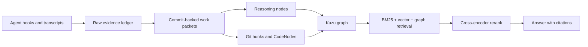

# Agent Memory Orchestrator

<p align="center">
  <strong>Local-first memory and reasoning graph for coding agents.</strong><br>
  AMO captures what happened, links it to code and commits, and lets Claude, Codex, and other agents retrieve the right context only when asked.
</p>

<p align="center">
  <a href="./LICENSE"></a>
  
  
  
</p>

---

## What It Is

Agent Memory Orchestrator, or AMO, is a local memory layer for AI coding work.

It turns agent sessions into a queryable graph of:

- user problems and decisions
- evidence and transcript references
- commits, files, code hunks, symbols, and tests
- reasoning nodes that explain why code changed
- retrieval-ready context with packet, commit, evidence, and code citations

AMO is not another chat history dump. The V2 graph treats Git and code as the factual spine, then uses local LLM extraction only to enrich the why.

## Why It Exists

AI coding sessions lose context fast. Git can show what changed, but not why the agent chose that change, what evidence supported it, or which later code/version depends on it.

AMO keeps that chain local and searchable:



## Quick Start

Prerequisites:

- Python 3.10+
- Node.js 18+
- pipx
- Ollama for local Qwen reasoning

```bash
ollama pull qwen3.5:9b
npx agent-memory-orchestrator-cli -- install --target codex --preset cpu-balanced --qwen-model qwen3.5:9b
amo-cli doctor --target codex
amo-daemon
```

Open the local UI:

```text
http://127.0.0.1:8765
http://127.0.0.1:8765/graph
```

Ask the graph directly:

```bash
amo-cli graph-search --query "why did retry logic change?"
```

<details>
<summary>Install from source instead</summary>

```bash
git clone https://github.com/spurbey/agent-memory-orchestrator.git
cd agent-memory-orchestrator
python -m venv .venv
. .venv/bin/activate
pip install -e ".[dev,models]"
amo-cli init-db
amo-cli init-graph
amo-daemon
```

Windows PowerShell activation:

```powershell
.\.venv\Scripts\Activate.ps1
```

</details>

<details>
<summary>Run indexed GraphRAG retrieval</summary>

Build graph retrieval docs, embed them, then retrieve with vector and cross-encoder reranking:

```bash
amo-cli graph-retrieval-build
amo-cli graph-retrieval-embed --model BAAI/bge-m3
AMO_RERANKER_BACKEND=cross-encoder amo-cli graph-retrieve --query "why did this code change?" --require-vector
```

On Windows PowerShell:

```powershell
$env:AMO_RERANKER_BACKEND="cross-encoder"
amo-cli graph-retrieve --query "why did this code change?" --require-vector
```

</details>

<details>
<summary>Connect Slack</summary>

Install the optional Slack Socket Mode runtime:

```bash
npx agent-memory-orchestrator-cli -- install --target codex --preset cpu-balanced --qwen-model qwen3.5:9b --with-slack
```

Create or configure the Slack app locally:

```bash
amo-cli slack setup-link
amo-cli slack setup-wizard
amo-cli slack run --reply-mode answer
```

In `answer` mode, AMO only posts when the bot is mentioned. Normal captured messages become local evidence and can later be drained into the graph.

Full guide: [Slack connector](./docs/integrations/slack.md).

</details>

## How Retrieval Works

AMO V2 retrieval is layered for precision:

1. classify the query
2. collect exact, BM25, and vector candidates
3. fuse candidates with deterministic scoring
4. expand only the top graph neighborhoods
5. rerank the top candidates with a local cross-encoder when available
6. answer with citations to packets, commits, evidence, and code nodes

Storage is local:

| Layer | Store | Purpose |
| --- | --- | --- |
| Raw evidence | JSONL / SQLite | Append-only capture and provenance |
| Graph truth | Kuzu | Sessions, packets, reasoning, commits, code nodes, edges |
| Retrieval ledger | SQLite FTS | Canonical retrieval documents and embedding metadata |
| Vector cache | FAISS | Rebuildable fast vector search cache |

## What Runs Automatically

Hooks capture evidence. They do not silently inject memory into every prompt.

Retrieval is explicit through CLI or MCP tools such as:

- `amo_graph_search`
- `amo_current_context`
- `amo_decision_history`
- `amo_work_history`
- `amo_raw_evidence`
- `amo_merge_status`

## Documentation

- [Documentation map](./docs/README.md)
- [Reasoning Graph V2](./docs/reasoning_graph/README.md)
- [Local development](./docs/setup/local-development.md)
- [Local models](./docs/setup/local-models.md)
- [Retrieval pipeline](./docs/operations/retrieval.md)
- [Slack connector](./docs/integrations/slack.md)
- [Repository layout](./docs/development/REPO_LAYOUT.md)

## Project Status

AMO is an active local-first product. The current direction is V2:

- Git-backed work packets are the durable factual unit.
- Reasoning nodes are extracted packet-wise and validated before graph promotion.
- Code hunks, AST-derived CodeNodes, and symbol versions anchor code history.
- Retrieval combines lexical, vector, graph expansion, and cross-encoder reranking.
- The central graph merge/versioning path is still being hardened.

## Contributing

Start with [CONTRIBUTING.md](./CONTRIBUTING.md). Keep changes local-first, provenance-preserving, and covered by tests.

```bash
python -m pytest -q
python -m ruff check src tests
```

## License

MIT. See [LICENSE](./LICENSE).
